# Modular Synthesizer GUI

A Phoenix LiveView application that provides an interactive graphical interface for creating, editing, and playing modular synthesizer networks using SuperCollider as the audio engine.

## User Documentation

### Overview

The Modular Synthesizer GUI is a web-based visual programming environment for creating modular synthesizer patches. It allows you to:

- Create synthesizer networks by connecting various audio modules (oscillators, filters, envelopes, etc.)
- Load and save synthesizer patches
- Play your creations using MIDI devices or MIDI files
- Real-time parameter control with visual feedback

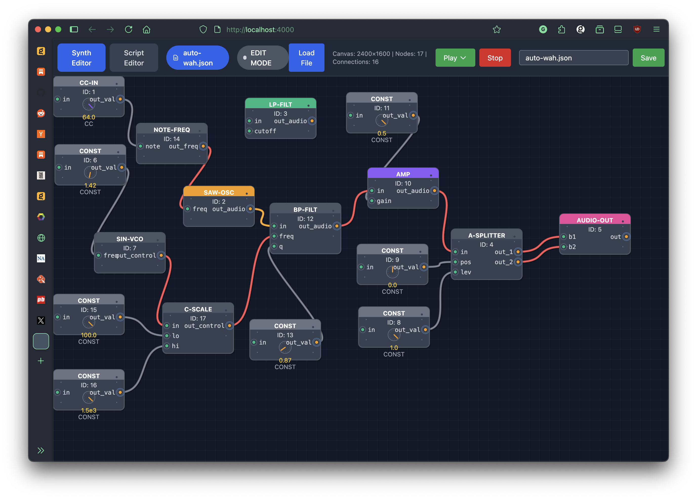

### Installation and Setup

#### Prerequisites

- Elixir 1.14+ and Erlang/OTP 25+
- SuperCollider 3.12+ with the `sc3-plugins` package
- A MIDI device or MIDI files for playback (optional)

#### Quick Start

1. Clone the repository and navigate to the project directory
2. Install dependencies:
   ```bash
   mix setup
   ```
3. Start the Phoenix server:
   ```bash
   mix phx.server
   ```
4. Open your browser and visit [`localhost:4000`](http://localhost:4000)

### Interface Guide

#### Main Canvas

The main canvas is where you create and edit your synthesizer networks. It features:

- **Grid background** for visual alignment
- **Zoom and pan capabilities** for working with large patches
- **Node placement** by right-clicking to open the creation menu
- **Connection system** for linking nodes together

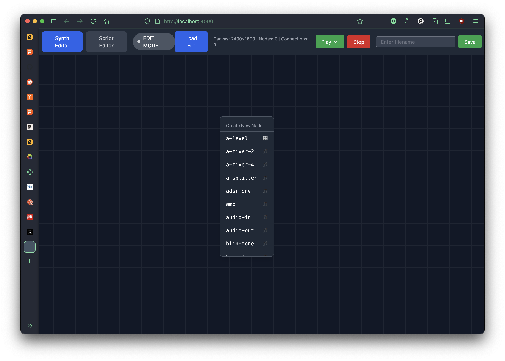

#### Node Types and Categories

**Oscillators** (Orange)
- `saw-osc` - Sawtooth wave oscillator
- `square-osc` - Square wave oscillator with pulse width control
- `s_sin-osc` - Sine wave oscillator
- `sin-vco` - Sine wave VCO for control signals

**Filters** (Green)
- `moog-filt` - Moog-style low-pass filter with resonance
- `bp-filt` - Band-pass filter
- `lp-filt` - Low-pass filter
- `hp-filt` - High-pass filter

**Envelopes & Amplifiers** (Purple)
- `adsr-env` - ADSR envelope generator
- `perc-env` - Percussive envelope generator
- `amp` - Amplifier with gain control

**Effects** (Blue)
- `freeverb` - Reverb effect
- `echo` - Echo/delay effect

**Utilities** (Gray)
- `const` - Constant value generator with knob control
- `c-splitter` - Control signal splitter
- `a-splitter` - Audio signal splitter
- `mult` - Signal multiplier

**I/O** (Pink)
- `midi-in` - MIDI input for frequency control
- `audio-out` - Audio output (stereo)
- `cc-in` - MIDI CC input

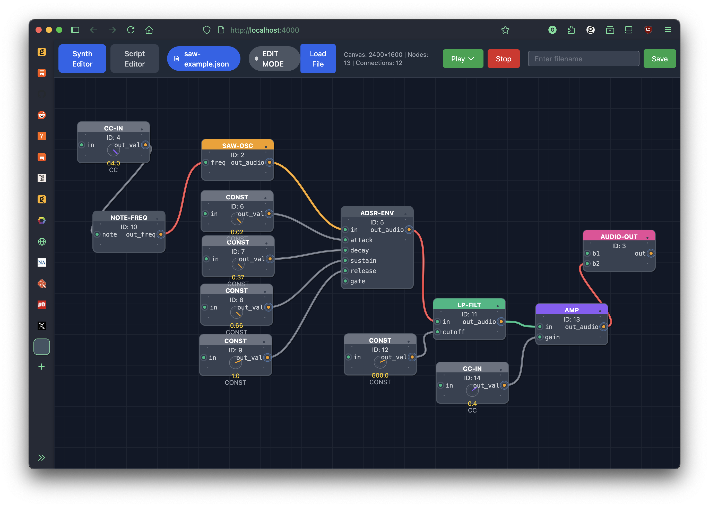

#### Creating Connections

1. **Start a connection** by clicking an output port (right side of nodes, orange circles)
2. **Complete the connection** by clicking an input port (left side of nodes, green circles)
3. **Delete connections** by clicking on the cable itself

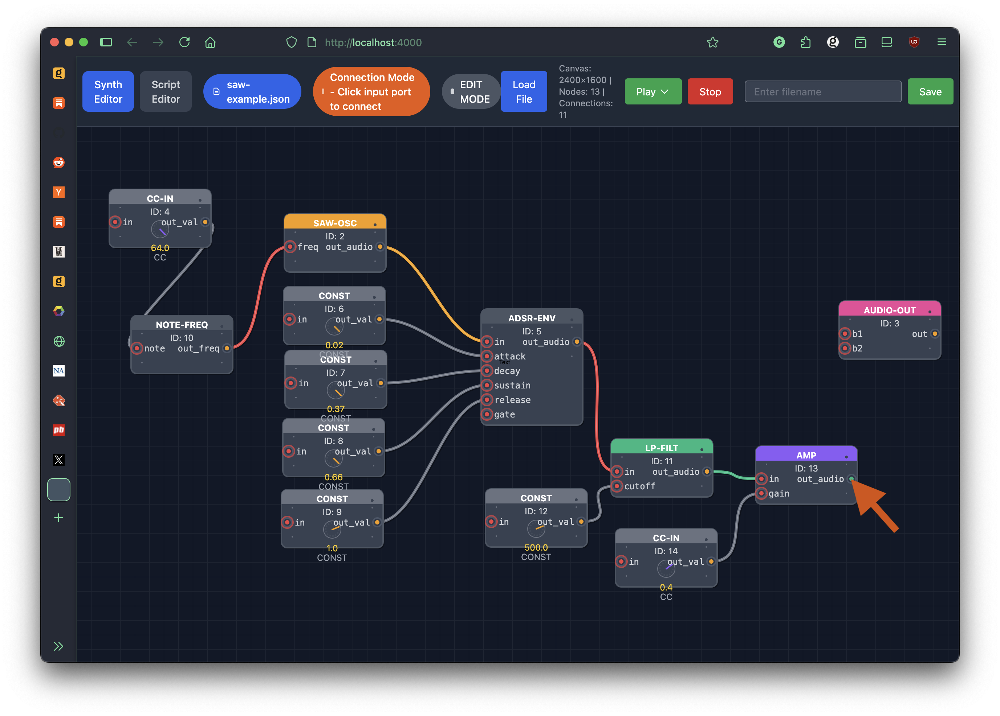

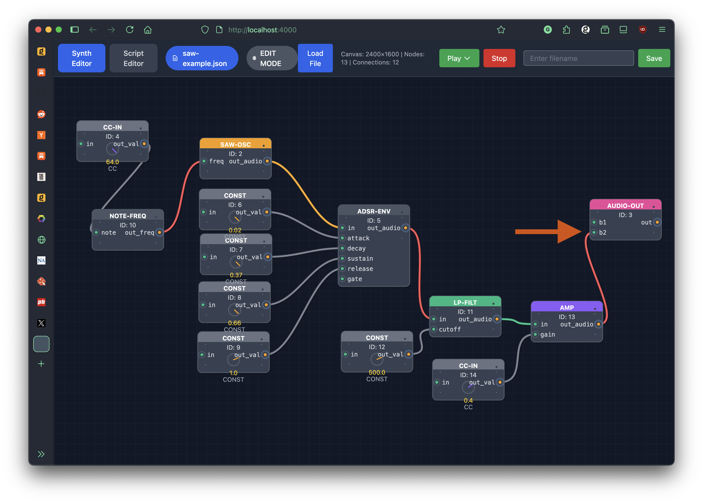

Port labels show the actual parameter names (freq, gain, cutoff, etc.) making it easy to understand what each connection does.

#### File Management

The file browser provides access to:

- **User files** (blue badges) - Your saved patches
- **Example files** (green badges) - Provided example patches
- **Alphabetical sorting** - Files are mixed and sorted for easy comparison
- **Scrollable list** - Handles large numbers of files

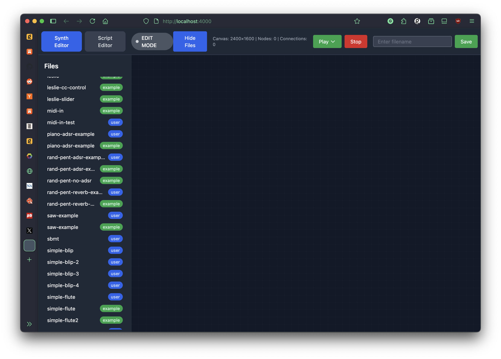

To save a patch:
1. Enter a filename in the save field
2. Click "Save"
3. The file will appear in the browser with a blue "user" badge

#### Parameter Control

**Constant (const) Nodes**
- Feature interactive knobs for real-time parameter control
- Display current value and allow precise adjustment
- Automatically set appropriate ranges based on usage

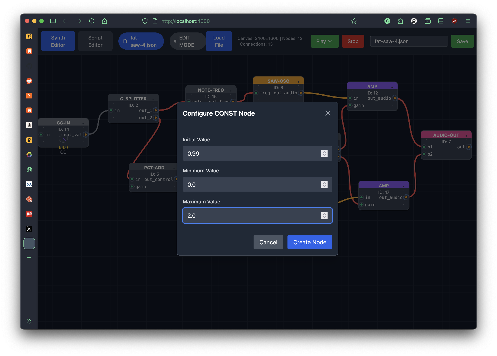

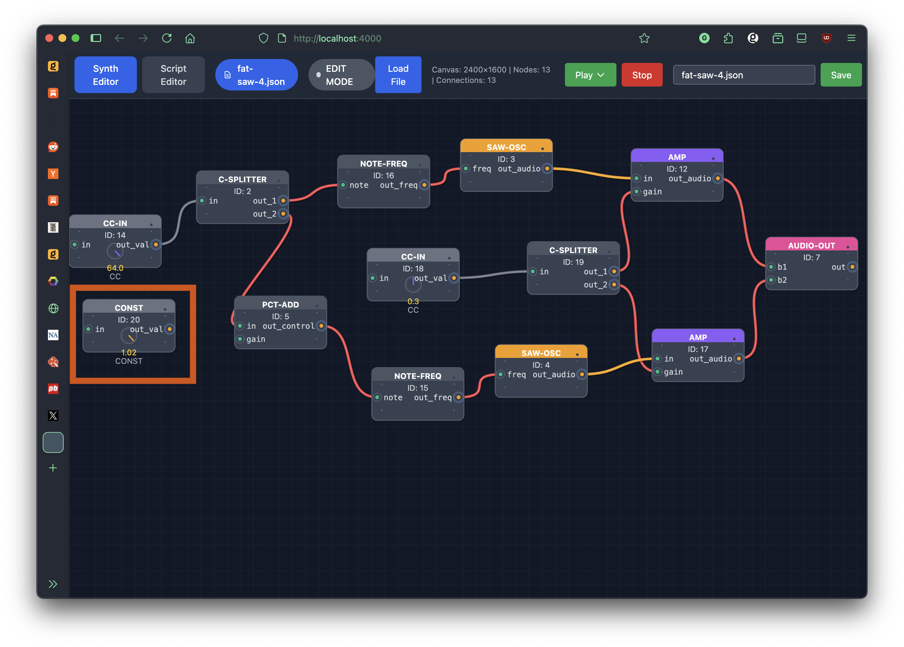

#### Node Information

Right-click any node to access:
- **Node Info** - View detailed parameter information
- **Delete Node** - Remove the node and all its connections

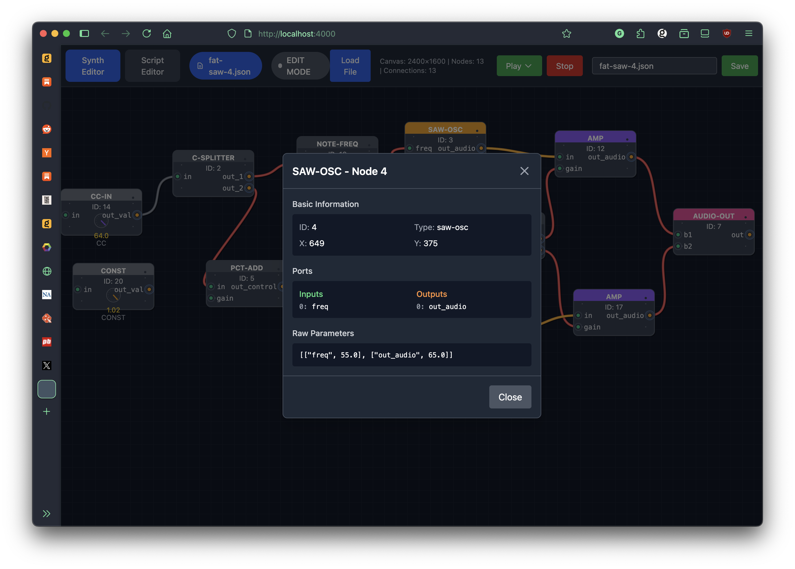

### Playing Your Patches

#### MIDI Device Playback

1. Click the "Play" button in the header
2. Select a MIDI device from the dropdown
3. Click "Play" to start the synthesizer
4. Use your MIDI device to play notes

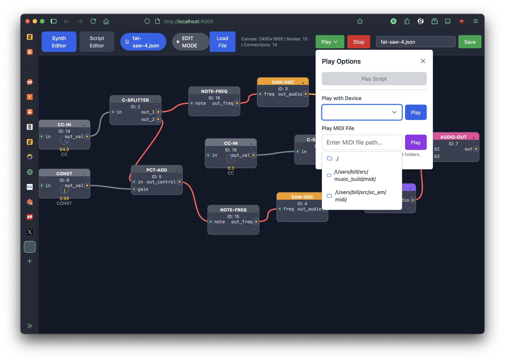

#### MIDI File Playback

1. Click the "Play" button in the header
2. Enter a path to a MIDI file or browse using the suggestions
3. Click "Play" to start playback
4. The file will play through your synthesizer patch

The path browser provides:
- **Current directory navigation** (type "./" to see current folder)
- **Configured MIDI directories** (pre-configured common locations)
- **Directory traversal** (use ".." to go up)
- **File filtering** (only shows .mid and .midi files)

#### Stop Playback

Click the "Stop" button to halt all audio playback and clean up MIDI connections.

### Configuration

#### Environment Variables

- `MODSYNTH_DIR` - Directory for user files (default: `~/.modsynth`)
- `MODSYNTH_MIDI_DIRS` - Semicolon-delimited list of MIDI directories to search

Example:
```bash
export MODSYNTH_MIDI_DIRS="/home/user/midi;/opt/midi;../custom_midi"
```

#### Logger Configuration

The application uses structured logging. Set the log level in `config/config.exs`:

```elixir
config :logger, :console, level: :info
```

### Troubleshooting

**Common Issues:**

1. **No audio output** - Check that SuperCollider is running and audio drivers are configured
2. **MIDI device not found** - Verify MIDI device is connected and recognized by the system
3. **File loading errors** - Check file permissions and JSON syntax
4. **Connection issues** - Ensure you're connecting outputs to inputs (not input to input)

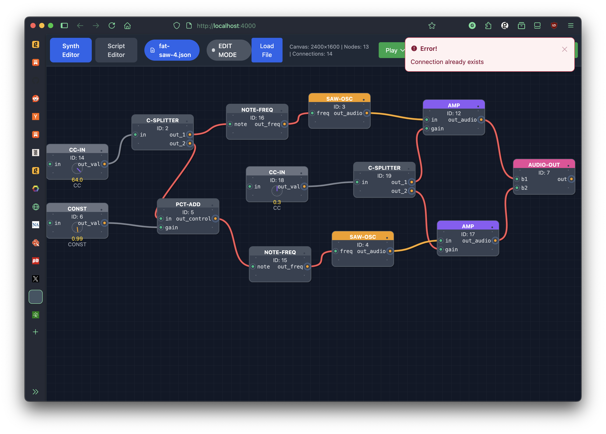

---

## Technical Documentation

### Architecture Overview

The application consists of several key components:

```
┌─────────────────────────────────────────────────────────────────┐
│                    Phoenix LiveView Frontend                    │
│  ┌─────────────────┐  ┌─────────────────┐  ┌─────────────────┐ │
│  │  SynthEditorLive │  │   FileManager   │  │   SynthManager  │ │
│  │     (UI Logic)   │  │  (File I/O)     │  │ (Audio Engine)  │ │
│  └─────────────────┘  └─────────────────┘  └─────────────────┘ │
└─────────────────────────────────────────────────────────────────┘
                                  │
                                  ▼
┌─────────────────────────────────────────────────────────────────┐
│                 SuperCollider Backend (sc_em)                   │
│  ┌─────────────────┐  ┌─────────────────┐  ┌─────────────────┐ │
│  │    Modsynth     │  │    ScClient     │  │   MidiPlayer    │ │
│  │  (Core Logic)   │  │  (SC Interface) │  │ (MIDI Playback) │ │
│  └─────────────────┘  └─────────────────┘  └─────────────────┘ │
└─────────────────────────────────────────────────────────────────┘
```

### Project Structure

```
modsynth_gui_phx/
├── lib/
│   ├── modsynth_gui_phx/
│   │   ├── application.ex          # Application supervisor
│   │   ├── file_manager.ex         # File operations
│   │   └── synth_manager.ex        # Backend integration
│   └── modsynth_gui_phx_web/
│       ├── live/
│       │   └── synth_editor_live.ex # Main UI component
│       ├── components/             # Reusable UI components
│       └── controllers/            # HTTP controllers
├── assets/
│   ├── js/
│   │   ├── app.js                 # Main JavaScript
│   │   └── synth_canvas.js        # Canvas interactions
│   └── css/                       # Styling
├── config/                        # Application configuration
└── ../sc_em/                      # SuperCollider backend
    ├── lib/                       # Core synthesizer logic
    ├── examples/                  # Example patches
    └── sc_defs/                   # SuperCollider definitions
```

### Key Components

#### SynthEditorLive (Main UI)

**File:** `lib/modsynth_gui_phx_web/live/synth_editor_live.ex`

The main LiveView component that handles:
- Canvas rendering and node management
- Real-time UI updates
- User interaction events
- Connection management between nodes

Key functions:
- `mount/3` - Initialize the LiveView with file lists and empty state
- `handle_event/3` - Process user interactions (clicks, drags, etc.)
- `render/1` - Generate the SVG canvas and UI elements

#### FileManager

**File:** `lib/modsynth_gui_phx/file_manager.ex`

Handles file operations:
- Loading and saving synthesizer patches (JSON format)
- Directory management for user and example files
- File listing with categorization

#### SynthManager

**File:** `lib/modsynth_gui_phx/synth_manager.ex`

GenServer that manages:
- Communication with SuperCollider backend
- MIDI device enumeration and playback
- Synthesizer state management
- Audio playback coordination

#### Canvas JavaScript

**File:** `assets/js/synth_canvas.js`

Handles client-side interactions:
- Node dragging and positioning
- Viewport resizing
- Knob control interactions
- Canvas event handling

### Data Flow

#### Loading a Patch

1. User clicks file in browser → `load_file` event
2. `FileManager.load_synth_file/1` reads JSON
3. `SynthManager.load_synth/1` processes data
4. Backend converts to enriched node format
5. UI updates with new nodes and connections

#### Creating Connections

1. User clicks output port → `port_clicked` event
2. UI enters connection mode
3. User clicks input port → connection validated
4. New connection added to state
5. Canvas re-renders with new cable

#### Playing Audio

1. User selects MIDI device/file → `play_with_device` event
2. `SynthManager` validates current synth
3. Backend loads patch into SuperCollider
4. MIDI routing established
5. Audio playback begins

### Development Setup

#### Prerequisites

- Elixir 1.14+ and Erlang/OTP 25+
- Phoenix 1.7+
- SuperCollider 3.12+ with sc3-plugins
- Node.js (for asset compilation)

#### Development Commands

```bash
# Install dependencies
mix deps.get

# Install Node.js dependencies
npm install --prefix assets

# Start development server
mix phx.server

# Run tests
mix test

# Check compilation
mix compile

# Build assets
mix assets.build
```

#### Code Structure Guidelines

- **LiveView Events**: Use descriptive event names matching user actions
- **State Management**: Keep UI state in socket assigns, audio state in GenServer
- **Error Handling**: Provide user-friendly error messages with flash notifications
- **Logging**: Use structured logging with appropriate levels (debug, info, warn, error)

### API Documentation

#### Phoenix LiveView Events

| Event | Parameters | Description |
|-------|------------|-------------|
| `load_file` | `path` | Load a synthesizer patch from file |
| `save_file` | `filename` | Save current patch to file |
| `node_moved` | `id`, `x`, `y` | Update node position |
| `port_clicked` | `node_id`, `port_type`, `port_index` | Handle port interaction |
| `create_node` | `node_type` | Create new node of specified type |
| `play_with_device` | - | Start playback with selected MIDI device |
| `stop_synth` | - | Stop all audio playback |

#### SynthManager GenServer API

| Function | Parameters | Returns | Description |
|----------|------------|---------|-------------|
| `load_synth/1` | `synth_data` | `{:ok, message}` | Load patch into backend |
| `get_current_synth_data/0` | - | `{:ok, synth_data}` | Get enriched node data |
| `play_synth_with_device/1` | `device_name` | `{:ok, message}` | Start MIDI playback |
| `stop_synth/0` | - | `{:ok, message}` | Stop playback |
| `get_midi_ports/0` | - | `{:ok, {ports, port_map}}` | Get available MIDI devices |

### Configuration Options

#### Application Configuration

**File:** `config/config.exs`

```elixir
# Logger configuration
config :logger, :console, level: :info

# MIDI directories for file browser
config :modsynth_gui_phx, :midi_directories,
  "../sc_em/midi;deps/midifile/test"

# Phoenix configuration
config :modsynth_gui_phx, ModsynthGuiPhxWeb.Endpoint,
  url: [host: "localhost"],
  render_errors: [view: ModsynthGuiPhxWeb.ErrorView],
  pubsub_server: ModsynthGuiPhx.PubSub
```

#### Runtime Configuration

**Environment Variables:**
- `MODSYNTH_DIR` - User files directory
- `MODSYNTH_MIDI_DIRS` - MIDI search directories
- `PHX_HOST` - Phoenix server host
- `PORT` - Server port

### Advanced Features

#### Custom Node Types

To add new node types:

1. Add SuperCollider definition to `../sc_em/sc_defs/`
2. Update `../sc_em/lib/modsynth.ex` with parameter definitions
3. Add UI styling in `synth_editor_live.ex` color mapping
4. Add port definitions in `get_node_ports_fallback/1`

#### MIDI Integration

The system supports:
- **Real-time MIDI input** for live performance
- **MIDI file playback** for automated sequences
- **MIDI CC control** for parameter automation
- **Multi-channel MIDI** routing

#### Parameter Mapping

The `parameter_rename_mapping.json` file handles parameter name translations between UI and backend, ensuring compatibility as the backend evolves.

### Testing

#### Running Tests

```bash
# Run all tests
mix test

# Run specific test file
mix test test/modsynth_gui_phx/file_manager_test.exs

# Run tests with coverage
mix test --cover
```

#### Test Structure

- **Unit Tests**: Test individual modules (FileManager, SynthManager)
- **Integration Tests**: Test LiveView interactions
- **End-to-End Tests**: Test complete workflows

### Contributing

#### Code Style

- Follow Elixir style guide
- Use `mix format` for code formatting
- Add documentation for public functions
- Include tests for new features

#### Pull Request Process

1. Create feature branch from `main`
2. Implement changes with tests
3. Update documentation
4. Submit PR with clear description

#### Commit Message Format

```
Brief description of change

Detailed explanation of what was changed and why.
Include any breaking changes or migration notes.

🤖 Generated with [Claude Code](https://claude.ai/code)

Co-Authored-By: Claude <noreply@anthropic.com>
```

### Deployment

#### Production Setup

1. Set production environment variables
2. Configure database (if using persistent storage)
3. Set up reverse proxy (nginx recommended)
4. Configure SSL certificates
5. Set up monitoring and logging

#### Docker Deployment

```dockerfile
FROM elixir:1.14-alpine

# Install build dependencies
RUN apk add --no-cache build-base npm git

# Create app directory
WORKDIR /app

# Copy mix files
COPY mix.exs mix.lock ./
RUN mix deps.get

# Copy source code
COPY . .

# Build application
RUN mix compile
RUN npm install --prefix assets
RUN mix assets.build

EXPOSE 4000
CMD ["mix", "phx.server"]
```

### License

This project is licensed under the MIT License - see the LICENSE file for details.

### Acknowledgments

- Phoenix Framework for the web application foundation
- SuperCollider for the audio engine
- LiveView for real-time UI updates
- The Elixir community for excellent tooling and support
